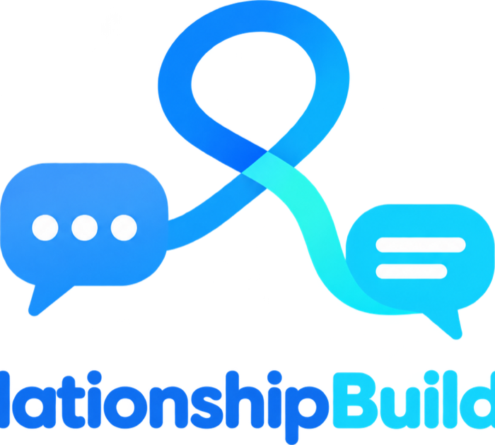

RelationshipBuilder helps you pick threads back up. It looks through your Messages
history, finds the conversations that may be worth returning to, reminds you what you
were talking about, and gives you one person at a time.

**[Download for Mac](https://github.com/JustinSteinberg/relationshipbuilder-releases/releases/latest/download/relationshipBuilder.dmg)** ·
**[Website](https://justinsteinberg.github.io/relationshipbuilder-releases/)**

Free. Requires macOS 14 or later. Universal (Apple Silicon and Intel). Signed and notarized by Apple.

Your message history is analyzed locally on your Mac. Nothing is uploaded to a
RelationshipBuilder server because there is no RelationshipBuilder server. There is no
account, no telemetry, and no message database somewhere else. It does not write your
messages for you.

This repository contains only release binaries and the website. The source is private.
